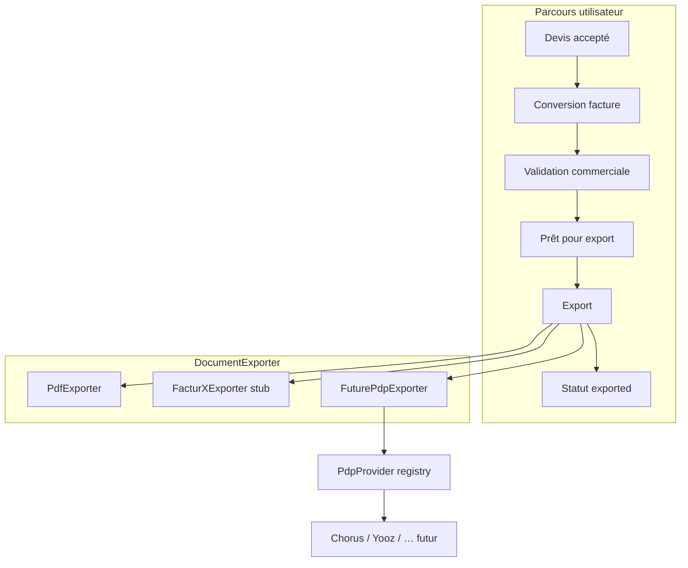

# Facturation électronique — architecture Basera

Basera prépare la compatibilité **Factur-X** et **PDP** sans implémenter de plateforme réelle. Le moteur commercial existant (devis, factures, PDF ReportLab) reste la source de vérité ; les nouvelles couches ajoutent validation, statuts d'export et points d'extension.

## Vue d'ensemble



## Architecture export

| Module | Rôle |
|--------|------|
| `document_export/base.py` | Interface `DocumentExporter` |
| `document_export/pdf_exporter.py` | PDF existant via ReportLab (aucune duplication) |
| `document_export/facturx_exporter.py` | Stub documenté — à implémenter plus tard |
| `document_export/pdp_exporter.py` | Route vers un `PdpProvider` enregistré |
| `document_export/registry.py` | Registre central `pdf` / `facturx` / `pdp` |
| `document_export/service.py` | `DocumentExportService`, construction du `ExportContext` |

### Formats supportés

- **`pdf`** — production, inchangé fonctionnellement
- **`facturx`** — lève `CommercialExportNotReadyError` (HTTP 501)
- **`pdp`** — nécessite un `PdpProvider` enregistré

### Endpoints

| Méthode | Route | Description |
|---------|-------|-------------|
| GET | `/api/commercial/export-formats` | Liste des formats |
| GET | `/api/commercial/invoices/{id}/lifecycle` | Statuts export + paiement |
| POST | `/api/commercial/invoices/{id}/validate` | Validation métier |
| POST | `/api/commercial/invoices/{id}/prepare-export` | Passe en `ready_for_export` |
| POST | `/api/commercial/invoices/{id}/export?format=` | Export structuré |

Les routes historiques `/api/quotes/{id}/pdf` et `/api/invoices/{id}/pdf` continuent de fonctionner (délèguent à `PdfExporter`).

## Statuts

### Export (`exportStatus` sur facture)

| Statut | Signification |
|--------|---------------|
| `draft` | Création / édition |
| `validated` | Validation réussie |
| `ready_for_export` | Prêt pour Factur-X ou PDP |
| `exported` | Export structuré effectué |
| `rejected` | Validation échouée |

### Paiement (`status` — inchangé)

`in_progress` · `paid` · `overdue` · `cancelled`

### Cycle de vie unifié (`lifecycleStatus` — calculé)

`draft` · `validated` · `ready_for_export` · `exported` · `rejected` · `paid` · `cancelled`

Priorité : `cancelled` > `paid` > statut export.

Transitions définies dans `commercial_status.py`.

## Validation commerciale

Service : `commercial_validation_service.py`

Contrôles **erreur** (bloquants) :

- Client présent et nom renseigné
- Adresse client (facturation)
- Lignes / montant HT > 0
- Cohérence HT / TTC (recalcul via `commercial_engine`)
- Numéro `FAC-YYYY-####`
- Date facture ISO valide
- Facture non annulée

Contrôles **avertissement** (non bloquants, PDP future) :

- SIRET / TVA client (si société)
- SIRET / TVA vendeur
- Ville client

Champs client préparés : `siret`, `vatNumber` (optionnels).

## Architecture PDP

| Module | Rôle |
|--------|------|
| `pdp/provider.py` | Interface `PdpProvider` |
| `pdp/models.py` | Payload et réponses normalisées |
| `pdp/registry.py` | Enregistrement des adaptateurs |

### Méthodes à implémenter par adaptateur

```python
async def send_invoice(payload) -> PdpSendResult
async def get_status(external_id) -> PdpInvoiceStatus
async def cancel_invoice(external_id) -> PdpCancelResult
async def sync_statuses(since) -> PdpStatusSyncResult
```

Aucun provider n'est enregistré par défaut.

### Connecter une PDP

1. Créer `backend/pdp/providers/chorus_pro.py` (exemple)
2. Implémenter `PdpProvider`
3. Au startup : `register_pdp_provider(ChorusProProvider())`
4. Export : `POST /api/commercial/invoices/{id}/export?format=pdp&pdpProvider=chorus_pro`

## Workflow devis → facture

1. Devis `accepted` → `POST /api/quotes/{id}/convert-to-invoice`
2. `run_post_conversion_workflow` :
   - initialise `exportStatus=draft`
   - lance la validation
   - si OK → `validated` puis `ready_for_export`
3. Export PDF possible à tout moment via route historique
4. Export Factur-X / PDP via workflow structuré

## Ajouter Factur-X

1. Implémenter `FacturXExporter.export()` dans `document_export/facturx_exporter.py` :
   - Générer XML CII EN16931
   - Embarquer dans PDF/A-3
   - Valider profil Factur-X
2. Retourner `ExportResult` avec métadonnées (`facturxProfile`, checksum XML)
3. Le workflow marquera automatiquement `exported`

Référence : `FacturXExporter.planned_output_shape()`.

## Tests

- `tests/test_commercial_validation.py`
- `tests/test_commercial_export.py`
- `tests/test_commercial_workflow.py`
- `tests/test_pdp_abstractions.py`

## Fichiers clés existants (non remplacés)

- `commercial_engine.py` — calculs HT/TVA/TTC
- `pdf_documents.py` — mise en page ReportLab
- `quotes.py` / `invoices.py` — CRUD et numérotation
- `quote_invoice_link.py` — liens devis ↔ facture
